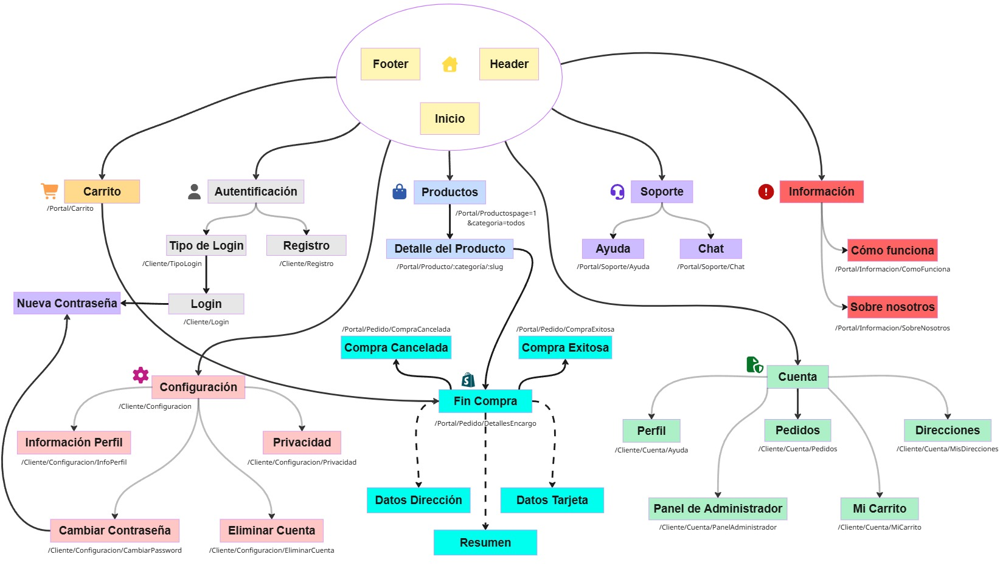

# MEMORIA DEL PROYECTO INTERMODULAR DEL CFGS DESARROLLO DE APLICACIONES WEB
En esta memoria se describe el desarrollo del proyecto final del ciclo formativo de Desarrollo de Aplicaciones Web (DAW). En este documento se recopilan todos los aspectos relacionados con el análisis, diseño, implementación y puesta en funcionamiento de la aplicación desarrollada.

El objetivo principal de esta memoria es explicar de forma detallada el proceso seguido durante la realización del proyecto, así como justificar las decisiones técnicas tomadas a lo largo del desarrollo.

A lo largo de los siguientes apartados se comentaran aspectos como las funcionalidades de la aplicación web, las tecnologías utilizadas, el diseño de la interfaz, la estructura de la base de datos, la implementación del backend y frontend, las pruebas realizadas y las posibles mejoras futuras del proyecto.

- Apartado 1 — Introducción y justificación
- Apartado 2 — Análisis y diseño del proyecto
- Apartado 3 — Conclusiones
- Apartado 4 — Bibliografía y fuentes de información
- Apartado 5 — Anexos

|        <!-- -->         |                           <!-- -->                            |
| :---------------------: | :-----------------------------------------------------------: |
| **Nombre del proyecto** |                           MerchNova                           |
|       **Nombre**        |                 Eduardo David Suárez Alvarado                 |
|    **Año académico**    |                        Año *2025/2026*                        |
|   **Ciclo y centro**    | *Desarrollo de Aplicaciones Web* — *IES Alonso de Avellaneda* |

---

## 1. Introducción y justificación
### Descripción de la aplicación a desarrollar
El proyecto que se va a desarrollar está relacionado con una plataforma de venta de comercio electrónico con el propósito de venta de productos personalizados. La plataforma permitirá a los usuarios explorar diferentes categorías de productos (`tazas, camisetas, peluches entre otros`), visualizar información detallada de cada artículo y realizar compras de forma sencilla y segura.

La finalidad principal de la aplicación es ofrecer una experiencia moderna y accesible para la compra de productos personalizados, permitiendo gestionar de manera eficiente tanto los productos como los usuarios y pedidos realizados dentro de la plataforma.

Entre las principales funcionalidades del sistema se incluyen el registro e inicio de sesión de usuarios (`Obligatorio para realizar compras en la aplicación`), la gestión del catálogo de productos, un carrito de compra (`Cada usuario tiene el suyo propio`), la realización de pedidos y un panel de administración para controlar distintos aspectos de la tienda como el registro de los pedidos de los usuarios (`Exclusivo para los usuarios administradores`).

Además, este proyecto tiene como objetivo aplicar y consolidar los conocimientos adquiridos durante el ciclo de Desarrollo de Aplicaciones Web (DAW), aparte de aplicar algunas funcionalidades no vistas anteriormente en el curso, utilizando tecnologías actuales tanto para el desarrollo del frontend como del backend; así como prácticas diseño, organización y seguridad en aplicaciones web.

### Motivación de mi elección
Una de las prioridades por elegir este proyecto es la interactuación con el que he ido teniendo con este tipo de aplicaciones en los últimos años, la posibilidad de pasar de utilizar una aplicación web que suelo visitar y utilizar a poder desarrollarla. Ya que es una de las aplicaciones más modernas y muy utilizada en el día a día en nuestra vida, llegando a tener millones de usuarios en todo el mundo.

Por otro lado, la idea de crear una tienda de productos personalizados resulta especialmente atractiva debido a la posibilidad de ofrecer artículos únicos y diferentes, permitiendo combinar creatividad y tecnología dentro de una misma aplicación.

Otro de los motivos que me ha llevado a la realización de este proyecto ha sido la oportunidad de aplicar de forma práctica los conocimientos adquiridos durante el ciclo de Desarrollo de Aplicaciones Web (DAW), trabajando desde las 2 partes que conforman el desarrollo (`Frontend y Backend`), la gestión de bases de datos (`No relacional`), la autenticación de usuarios y el diseño de interfaces modernas y funcionales.

Por último, este proyecto también supone una forma de poder consolidar y volver a repasar todo lo adquirido este año, ya que permite simular el desarrollo de una aplicación real, enfrentándose a problemas y situaciones similares a las que pueden encontrarse en el ámbito laboral del desarrollo web.

---

## 2. Análisis y diseño del proyecto

### 2.1 Descripción de la arquitectura web
La aplicación se basa en una arquitectura Single Page Application (SPA) que consiste en una única página HTML y que va cambiando de forma dinámica a través de JavaScript que permite otorgar una experiencia de usuario muy fluida e interactiva. Las partes que componen la aplicación son las siguientes:

1. Frontend: es la parte visual con la que interactúan los usuarios. Se encargara de mostrar la interfaz gráfica, gestionar la navegación entre vistas y enviar solicitudes al servidor (`NodeJS`) para obtener o modificar información.

La aplicación frontend ha sido desarrollada utilizando tecnologías modernas orientadas al desarrollo de interfaces dinámicas y responsivas. Entre sus funciones principales se encuentran:

- Visualización del catálogo de productos.
    - Paginación de los productos
    - Filtrado de productos según su categoría, valoración o precio.

- Gestión del carrito de compra.
    - Carrito con persistencia (`Evita perdida de productos y exclusivo para cada usuario`).
    - Modificación de la cantidad introducida.

- Registro e inicio de sesión de usuarios.
   - Incluye también inicio de sesión con Google y Discord.
   - Dispone de ReCaptcha que es un sistema de seguridad que nos permite proteger los sitios web del spam y los ataques automatizados.

- Visualización y gestión de pedidos.
    - Los usuarios visualizan sus pedidos.
    - Los administradores visualizan y gestionan todos los pedidos de todos los usuarios y pueden cancelar los que quedan `Pendientes`.

- Panel de administración.
   - Exclusivo para administradores.

Al tratarse de una SPA, el cambio entre páginas o secciones se realiza de manera dinámica mediante un sistema de rutas del cliente, sin necesidad de recargar completamente la aplicación, mediante la biblioteca de `React Router DOM`, robusta y versátil que se utiliza para el enrutamiento de una aplicación React.

1. Backend: se encargara de procesar la lógica de negocio de la aplicación y gestionar la comunicación con la base de datos (`MongoDB`).

Entre sus responsabilidades principales destacan las siguentes:

- Gestión de usuarios y autenticación (`JsonWebToken`).
- Gestión de productos y categorías.
- Procesamiento de pedidos y gestión de datos.
- Control del stock.
- Validación de datos.
- Exposición de una API REST para la comunicación con el frontend.

El frontend y el backend se comunican mediante peticiones HTTP utilizando formatos de intercambio de datos como JSON.

3. Base de datos: la última y una de las más importantes, será la encargada de almacenar toda la información necesaria para el funcionamiento de la aplicación, como:

- Usuarios registrados y su información personal.
- Productos y categorías.
- Pedidos realizados.
- Direcciones del usuario
- Información del carrito.
- Valoraciones y datos adicionales.
- Métodos de pago e información personal del responsable.

El backend es el encargado de realizar las operaciones de lectura, inserción, modificación, eliminación de datos dentro de la base de datos y cualquier otro tipo de verificación.

Por último, la comunicación entre los diferentes componentes de la aplicación sigue el siguiente flujo:

 - El usuario interactúa con la interfaz frontend.
 - El frontend realiza una petición HTTP al backend mediante la API REST.
 - El backend procesa la solicitud y consulta la base de datos si es necesario.
 - La base de datos devuelve la información requerida al backend (si es requerido).
 - El backend responde al frontend y devuelve una respuesta en formato JSON (en algún caso redirige).
 - El frontend maneja y actualiza dinámicamente la interfaz con los datos recibidos.

Debido a esta arquitectura, la aplicación mantiene una estructura modular, organizada y escalable, facilitando tanto el mantenimiento como posibles futuras ampliaciones de la plataforma.

---

### 2.2 Tecnologías y herramientas utilizadas
Para el desarrollo de la aplicación se han implementado diferentes tecnologías tanto para el frontend como para el backend, la base de datos y el despliegue del proyecto.

#### Frontend
En el frontend, la tecnología aplicada es React.

##### React
React es un framework de JavaScript orientada al desarrollo de interfaces de usuario dinámicas e interactivas mediante estructuras llamadas componentes reutilizables. Su uso permite crear aplicaciones SPA (Single Page Application), mejorando la experiencia del usuario gracias a la carga dinámica de contenido sin recargar la página completa.

Entre las ventajas de utilizar React destacan las siguentes:

- Desarrollo basado en componentes reutilizables utilizando JSX.
- Uso de un DOM virtual que ofrece rapidez y fluidez en la aplicación.
- Renderizado de interfaces dinámicas y eficiente.
- Gran compatibilidad con librerías externas.
- Creación de aplicaciones móviles nativas con React Native.
- Amplia comunidad y documentación.

##### Vite
Vite es una herramienta de compilación que tiene como objetivo proporcionar una experiencia de desarrollo más rápida y ágil para proyectos web modernos. Formado por un servidor de desarrollo que consta de funcionalidades mejoradas. Sus principales ventajas son:

- Inicio rápido del servidor de desarrollo.
- Compilación optimizada.
- Mejor rendimiento en comparación con otras herramientas tradicionales.
- Configuración sencilla.
- Actualización rápida ante los cambios realizados.

--- 

#### Backend
Para el desarrollo del servidor y la lógica de negocio se ha utilizado Node.js siguiendo una arquitectura basada en API RESTful, que devuelve respuestas en formato `JSON` al cliente.

##### Node.js
Node.js es un entorno que permite ejecutar JavaScript en el lado del servidor, que facilita el desarrollo completo de la aplicación utilizando un único lenguaje tanto en frontend como en backend. Entre sus características principales destacan:

- Alto rendimiento.
- Arquitectura asíncrona y no bloqueante.
- Escalabilidad, adecuado en arquitectura de microservicios.
- Gran ecosistema de paquetes mediante npm (`Node Package Manager`).
- API RESTful que devuelve respuestas en formato JSON.

La comunicación entre frontend y backend se realiza mediante una API RESTful basada en peticiones HTTP. Se utilizan algunos métodos HTTP como:

`GET` - Obtener información.
`POST` - Crear recursos.
`PUT/PATCH` - Actualizar información.
`DELETE` - Eliminar recursos.

> Los métodos que suelen utilizar generalmente son `POST` y `GET`.

---

#### Base de datos
La base de datos utilizada en el proyecto es MongoDB, que se explicará a continuación...

##### MongoDB
MongoDB es una base de datos NoSQL de alto rendimiento orientada a documentos que almacena la información en formato BSON, similar a JSON, eliminando los esquemas fijos y tablas que utiliza una base de datos SQL. Su elección se debe a los siguientes motivos:

- Flexibilidad en la estructura de datos.
- Escalabilidad.
- Buen rendimiento para aplicaciones web modernas.
- Buena asociación con React + NodeJS.

En ella se almacenan datos relacionados con los siguentes datos:

- Usuarios.
- Información del usuario (`direcciones`, `datos de la cuenta`, etc).
- Datos del pago.
- Productos.
- Pedidos.
- Carrito de compra.
- Categorías.
- Chat de soporte técnico.

---

#### Integración y pruebas
Durante el desarrollo del proyecto se han realizado diferentes pruebas para garantizar el correcto funcionamiento de la aplicación y la válidez de los datos. Entre las pruebas realizadas destacan:

- Pruebas de navegación entre vistas.
- Validación de formularios.
- Comprobación de autenticación y autorización.
- Verificación de peticiones a la API.
- Pruebas de funcionamiento del carrito y pedidos.
- Comprobación de la correcta conexión con la base de datos.
- Depuración de código para garantizar la información que proviene de las distintas partes de la aplicación.

También se han utilizado las herramientas de desarrollo del navegador y algunas pruebas manuales para detectar errores y mejorar la experiencia de usuario.

---

#### Seguridad
Para mejorar la seguridad de la aplicación se han aplicado diferentes medidas de protección tanto en frontend como en backend. Entre ellas destacan:

- Autenticación de usuarios mediante tokens.
- Encriptación de contraseñas.
- Validación de datos enviados por el usuario.
- Protección de rutas privadas sin acceso para usuarios sin login.
- Control de permisos según el tipo de usuario (`clientes` y `administradores`).
- Gestión segura de datos sensibles mediante el uso variables de entorno.
- Recuperación de datos en caso de caída del servidor.

Estas medidas ayudan a proteger la información de los usuarios y garantizar un acceso seguro a la aplicación.

---

#### Otras herramientas utilizadas
Además de las tecnologías principales, durante el desarrollo del proyecto se han utilizado otras herramientas complementarias:

- Git para el control de versiones (desde terminal `VSC`).
- GitHub para el almacenamiento y gestión del repositorio.
- Postman para probar las rutas de la API.

---

### 2.3 Análisis de usuarios (Perfiles de usuario)
La aplicación está diseñada para ser utilizada por diferentes tipos de usuarios (`visitantes`, `usuarios registrados` y `usuarios administradores`), cada uno con funcionalidades y permisos específicos dentro de la aplicación. La división de perfiles me permite organizar correctamente el acceso a la información y garantizar la seguridad y el correcto funcionamiento de la plataforma. Disponemos de 3 tipos de usuarios, que son:

##### Usuario visitante
El usuario visitante es cualquier persona que accede a la aplicación sin haber iniciado sesión. Tiene los siguientes permisos:

- Necesidades principales.
- Navegar por el catálogo de productos.
- Visualizar información detallada de los productos y consultar precios, imágenes y valoraciones.
- Buscar productos por categorías.
- Registrarse para realizar compras.
- Añadir productos deseados al carrito de compras.
- No puede realizar pedidos ni acceder a funciones privadas.
- No puede gestionar su perfil ni los pedidos de los usuarios.
- No puede utilizar el soporte técnico.


> El perfil de visitante es el que representa a cualquier usuario que viene a echar un vistazo a la tienda y visualizar sus productos y las funcionalidades de las que dispone.


##### Usuario registrado
Este usuario corresponde a los clientes que disponen de una cuenta dentro de la plataforma, que previamente se hayan registrado y activado su cuenta. Estos son sus permisos (junto a algunos de los vistos anteriormente):

- Iniciar sesión de forma segura.
- Gestionar y modificar su perfil personal y sus direcciones.
- Gestión e incorporación de productos al carrito.
- Realizar pedidos.
- Consultar historial de compras (pedidos).
- Modificación de datos sensibles como la contraseña.
- Acceso a funcionalidades privadas como el chat de ayuda.


> Este perfil representa el principal tipo de usuario de la aplicación, ya que interactúa directamente con el sistema de compra de la tienda online.


##### Usuario administrador
Este usuario dispone de los permisos del anterior sumados a los siguientes:
- Gestionar el catálogo de productos (añadir, modificar o eliminar productos).
- Controlar pedidos realizados por los clientes.
- Gestión y control de usuarios registrados (futura mejora).
- Supervisar el funcionamiento de la aplicación.
- Acceso completo al panel de administración y funcionalidades restringidas.
- Administración del contenido de la tienda.
- Asistente de ayuda a los clientes.


> El administrador es el usuario encargado de gestionar y supervisar el funcionamiento general de la plataforma. dispone de permisos especiales que permiten mantener actualizada la plataforma y garantizar su funcionamiento.


La aplicación implementa un sistema de control de acceso basado en roles de usuario. Dependiendo del tipo de cuenta autenticada, el sistema habilita o restringe determinadas funcionalidades. Por ello:

- Se mejora la seguridad de la aplicación (evitando acceder a rutas privadas).
- Se protege la información sensible.
- Se evita el acceso no autorizado a funciones administrativas.
- Se ofrece una experiencia adaptada a cada tipo de usuario.


> De esta forma, cada usuario interactúa únicamente con las herramientas y opciones necesarias según su función dentro de la plataforma.

---

### 2.4 Definición de requisitos funcionales y no funcionales

#### Requisitos funcionales
Los requisitos funcionales describen las funcionalidades y acciones que la aplicación debe ser capaz de realizar para garantizar el correcto funcionamiento de la tienda online.

##### Usuarios
- La gestión de usuarios, el sistema debe permitir el registro de nuevos usuarios. Una vez registrado, el usuario puede iniciar y cerrar de sesión. Dentro de la sesión, el usuario ya podrá modificar sus datos personales según el tipo de inicio de sesión que has escogido (en este caso, con `email` puedes modificar todos los campos y con otro tipo hay campos que no podrás modificar).
- La tienda online deberá diferenciar entre usuarios cliente y administrador, mostrando alguna etiqueta en el perfil o algo parecido.
- Restringir el acceso a determinadas rutas según el rol del usuario (dispone de `visitante`, `registrado` y `administrador`).

##### Gestión de productos, en la aplicación:
- Se mostrará un catálogo de productos personalizados.
- Podrá visualizar información detallada de cada producto.
- Se permitirá clasificar productos por categorías, valoración o precio.
- El administrador podrá añadir nuevos productos.
- El administrador podrá editar productos existentes.
- El administrador podrá eliminar productos del catálogo.

##### Carrito de compra, donde el usuario:
- Podrá añadir productos al carrito.
- Podrá modificar cantidades de productos.
- Podrá eliminar productos del carrito.
- Y el sistema calculará automáticamente el importe total del pedido.

##### Gestión de pedidos:
- El usuario podrá realizar pedidos.
- El sistema almacenará la información de los pedidos realizados (sin información sensible).
- El usuario podrá consultar su historial de compras.
- El administrador podrá visualizar y gestionar todos los pedidos de los clientes.
- La aplicación deberá permitir una navegación dinámica entre vistas sin recargar la página.
- El usuario podrá acceder rápidamente a las diferentes secciones de la tienda.
- El frontend deberá comunicarse con el backend mediante una API RESTful.
- El intercambio de información deberá realizarse en formato JSON.

#### Requisitos no funcionales
Los requisitos no funcionales definen las características técnicas y de calidad que debe cumplir la aplicación para garantizar una experiencia adecuada y un funcionamiento eficiente para el usuario que la va a utilizar.

##### Rendimiento
- La aplicación deberá ofrecer tiempos de carga reducidos.
- Las peticiones al servidor deberán responder de forma rápida y eficiente.
- La navegación entre páginas deberá ser fluida gracias al modelo SPA.

##### Usabilidad
- La interfaz deberá ser intuitiva y fácil de utilizar.
- El diseño debe de facilitar la navegación del usuario.
- Los elementos visuales deberán mantener una estructura clara y organizada.
- Diseño responsive para que la aplicación se adapte diferente tipo de pantallas.
- El sistema deberá ser compatible con dispositivos móviles, tablets y ordenadores.

##### Seguridad
- Las contraseñas deberán almacenarse de forma cifrada.
- El sistema deberá proteger las rutas privadas mediante autenticación o redirección inmediata.
- Solo los administradores podrán acceder a funciones de gestión.
- La aplicación deberá validar los datos recibidos para evitar accesos no autorizados o errores.


##### Escalabilidad
- La arquitectura de la aplicación deberá permitir añadir nuevas funcionalidades en el futuro.
- El sistema deberá mantener una estructura modular y organizada.

##### Mantenibilidad
- El código deberá de ser legible, estructurado y organizado correctamente.
- Se utilizarán componentes reutilizables para facilitar futuras modificaciones.
- La separación entre frontend, backend y base de datos facilitará el mantenimiento y control del proyecto.

##### Compatibilidad
- La aplicación deberá funcionar correctamente en los navegadores modernos más utilizados.
- El sistema deberá mantener compatibilidad con distintos sistemas operativos.
 
##### Dsponibilidad
- La aplicación deberá estar accesible siempre que el servidor se encuentre operativo.
- El sistema deberá minimizar errores críticos que afecten al uso de la plataforma como la pérdida de datos.

---

### 2.5 Estructura de navegación
En este punto, mostraremos el mapa de la plataforma. En ella se puede representar de forma visual, toda la estructura SPA de la aplicacíon web, tanto sus diferentes partes como las rutas asignadas a cada una de ellas. 
La estructura parte desde la página principal de inicio y se divide en varias secciones principales, como el catálogo de productos, la gestión de cuenta de usuario, el sistema de autenticación, el soporte al cliente y el flujo de compra. Además, se diferencian las rutas públicas de aquellas que requieren autenticación mediante distintos colores y conexiones, y también de los componentes padres e hijos mediante lineas normales y discontinuas.

#### Mapa del sitio


---

### 2.6 Organización de la lógica de negocio
La lógica de negocio de la aplicación se encuentra implementada principalmente en el backend, encargado de procesar las solicitudes realizadas por los usuarios, gestionar la información almacenada en la base de datos y controlar el funcionamiento general del sistema.
Para facilitar el mantenimiento y la escalabilidad del proyecto, el backend se ha organizado siguiendo una estructura modular, separando cada responsabilidad en diferentes carpetas y módulos independientes.

#### Estructura general del backend
La aplicación backend se organiza en distintas capas con funciones específicas:
Rutas: las rutas definen los endpoints de la API RESTful y gestionan las solicitudes HTTP enviadas desde el frontend. Cada conjunto de rutas se encuentra separado según la funcionalidad correspondiente, por ejemplo:

- Rutas de autentificación (usuarios y tokens).
- Rutas de productos (`filtrado`o por `categorías`).
- Rutas del carrito.
- Rutas de la pasarela de pago.
- Rutas del perfil del usuario.


> Estas rutas reciben las peticiones del cliente y las redirigen hacia la lógica correspondiente.


#### Servicios
Algunas funcionalidades auxiliares se encuentran separadas en módulos independientes para facilitar la reutilización del código. También destacan las peticiones a APIs externas. Entre ellas destacan:

- Gestión de JsonWebToken.
- Envío de emails con la API de Mailjet.
- Gestión de la pasarela de pago.


#### Conexión con APIs de terceros y servicios externos
La aplicación puede integrarse con distintos servicios externos para ampliar funcionalidades y mejorar la experiencia del usuario. Entre ellas podemos encontrar:
    
- Pasarelas de pago
    La tienda online puede conectarse con plataformas de pago externas para permitir la realización de compras de forma segura y eficaz. Esto permite procesar pagos online, validar transacciones, gestionar el método de pago, etc. La comunicación con estos servicios se realiza mediante APIs proporcionadas por las propias plataformas.

- Servicios de autenticación
    La aplicación cuenta con autentificación de Google o Discord, que permiten iniciar sesión sin introducir ningún dato, recogiendo su información a través de las plataformas anteriormente mencionadas. Para ello, se requiere de la comunicación de la API tanto de Google como de Discord que ponen a disposición en sus aplicaciones. Por ello, permite al usuario a mantener su sesión activa, como un usuario normal, evita introducir cualquier dato al recogerlo de las plataformas que el usuario haya utilizado para el registro.

- Servicios de email
    Otra plataforma con la que podemos comunicar es con la API de Mailjet, un proveedor de servicios de correo electrónico que permite enviar emails transaccionales de forma automática dentro de nuestra aplicación con el objetivo de activar las cuentas que se quieran registrar, recuperación de contraseña, confirmar el pago de los pedidos, notificaciones, entre otros posibles usos.

- Servicios de ubicación
    Este servicio nos permite obtener todos los países del mundo (`nombre`, `bandera`, `idiomas`, ...), que posteriormente se utilizan a la hora de configurar nuestro perfil.

Por ello, esta estructura flexible, la aplicación puede ampliarse y adaptarse fácilmente a nuevas necesidades o funcionalidades que se implementarán en el futuro, permitiendo reutilizar código.

---

### 2.7 Modelo de datos simplificado
La aplicación utiliza una base de datos NoSQL basada en documentos JSON mediante MongoDB. La información se organiza en colecciones que almacenan distintos tipos de datos relacionados con el funcionamiento de la tienda online.
Cada colección agrupa documentos con estructuras flexibles adaptadas a las necesidades de la aplicación. Esta organización facilita la escalabilidad y la gestión de la información.

#### Colección de clientes
En primer lugar, tenemos la colección `clientes` que almacena toda la información relacionada con los usuarios registrados en la plataforma.
Cada documento representa un usuario e incluye información personal, datos de autenticación, pedidos realizados, carrito de compra y direcciones guardadas, además cuenta con un identificador que lo diferencia de otros usuarios. Ejemplo de una colección con estructura reducida:
```
    {
        "nombreCompleto": "...",
        "cuenta": {
            "email": '...',
            "password": '...',
            "genero": '...',
            "cuentaActiva": true,
            "imagenCuenta": '...',
            "creacionCuenta": 1776521930748,
            ...
        },
        "pedidos": [], // <--- "estado": '...', "fechaPago": 'Date', "metodoPago": {...}, ...
        "carrito": {}, // <--- "itemsPedido": [...], "gastosEnvio": 0, "subtotal": 0, "total": 0
        "direcciones": [], //<--- "domicilio": '...', "municipio": '...', "provincia": '...', "codigo_postal": '...', "pais": '...'
        "chat": []  // <--- El usuario normal puede tener varios chats hablando de diferentes temas mensajes: [], datosAdmin: {}, datosCliente: {}, timestamp: 'Date', estado: '...', fechaInicioChat: 'Date', fechaFinChat: 'Date'
    }
```

##### Cuenta
Poco a poco vamos describiendo cada propiedad (propiedades con `objetos` y `arrays`). Para empezar tenemos la propiedad `cuenta` donde se almacenan los datos relacionados con el acceso y configuración del usuario. Sus datos principales son:

- Correo electrónico.
- Contraseña (cifrada).
- Género (Generalmente puede ser `Masculino`, `Femenino`, `Neutro`, `Prefiero no decirlo`).
- Estado de activación de la cuenta.
- Imagen de perfil (Serializada en `Base64`).
- Fecha de creación (Formato `Date`).
- Información personal adicional (`Sobre mi`).
- Número de teléfono.
- Tipo de autenticación.
- Rol del usuario.
- Configuración de privacidad y notificaciones.

Ejemplo de visualización: 
```
    {
        "cuenta": {
            "email": "...",
            "password": "...$",
            "imagenCuenta": "data:image...",
            "fechaCreacion": 'Date'
            "rol": "ADMINISTRADOR",
            "visibilidad": "publico"
            ...
        }
    }
```

##### Pedidos
Cada cliente dispone de un array de `pedidos` donde se almacena el historial de compras realizadas dentro de la plataforma. Cada pedido contiene información relacionada con:

- [Productos comprados](#propiedades-de-la-tienda) -> consta de un array y tiene relación con el producto y contiene todos los datos del producto, que comentaremos posteriormente.
- Cantidad de productos.
- Estado del pedido.
- Fecha de pago y de envío.
- Método de pago.
- Dirección de envío.
- Dirección de facturación.
- Costes y total del pedido.
- Otros datos (información del `pagador`)

Ejemplo de visualización:
```
    {
        "pedidos": [
            {
                "items": [
                    {
                        "producto": {
                            "_id": "...",
                            "nombre": "...",
                            "precio": 20.99
                        },
                        "quantity": 1
                    }
                ],
                "estado": "COMPLETED",
                "subtotal": 20.99,
                "gastosEnvio": 1.03,
                "total": 22.02,
                ...
            }
        ]
    }
```

##### Carrito
El documento del usuario también contiene un objeto `carrito` que almacena temporalmente los productos seleccionados antes de finalizar una compra. Cada usuario tendrá su propio carrito con sus respectivos productos.

- Información del producto añadido -> Cantidades seleccionadas.
- Total.
- Subtotal.
- Gastos de envío (por defecto será de `1.03 €`).
- Precio total.

Ejemplo visualizado:
```
    {
        "carrito": {
            "itemsPedido": [], <--- Información de los productos añadidos
            "subtotal": 0,
            "total": 1.03
        }
    }
```

##### Direcciones
La colección también almacena múltiples direcciones asociadas a cada cliente para facilitar futuros pedidos. Como máximo, el usuario podrá disponer de tan solo 3 direcciones.

- Domicilio.
- Provincia.
- Municipio.
- Código postal.
- País.

Ejemplo de visualización:

```
    {
        "direcciones": [
            {
                "domicilio": "...",
                "provincia": "...",
                "municipio": "...",
                "codigoPostal": "...",
                "pais": "Spain"
            }
        ]
    }
```

> Las relaciones principales de la colección `clientes` son las siguientes:
>   `Productos` — mediante los pedidos y carrito de compra.
>   `Pedidos` — almacenados directamente dentro del usuario.
>   `Direcciones` — asociadas al cliente para envíos y facturación.

Esta estructura permite centralizar casi toda parte de la información relacionada con el usuario dentro de un único documento, facilitando consultas rápidas y reduciendo la complejidad de algunas operaciones en la base de datos.

#### Colección de productos
La colección `productos` almacena toda la información relacionada con los artículos disponibles dentro de la tienda online.
Cada documento representa un producto individual y contiene información necesaria para su visualización, clasificación y gestión dentro de la plataforma. Como en la coleccion descrita anteriormente, esta también se identifica con un id (`identificador`) que diferencia de las demás.

Esta colección es una de las principales de la aplicación, ya que se encuentra directamente relacionada con funcionalidades como el catálogo de productos, el carrito de compra y los pedidos realizados por los usuarios.

##### Propiedades de la tienda
En esta colección podemos encontrar una variedad de propiedades que describen el producto, además tendran una relación con pedidos (`clientes`). Dentro de cada pedido se almacena información del producto adquirido, incluyendo datos como:

- Nombre y descripción del producto (propiedades separadas).
- Precio del producto.
- Rebaja del producto.
- Imagen.
- Categoría.
- Talla (dependiendo de la categoría, puede ser `null`).
- Valoraciones.
- Stock (si es 0, no se puede adquirir).
- Fecha de subida por parte del administrador.
- Slug (formado por categoría-nombre).
- Path (utilizado para numerar los productos).

Ejemplo de visualización:

```
    {
        "nombre": "...",
        "descripcion": "...",
        "precio": 15.99,
        "rebaja": 0,
        "imagen": "...",
        "categoria": "...",
        "talla": [], <--- null dependiendo de la categoría
        "stock": 25,
        "valoraciones": 4.1,
        "slug": "taza-mia",
        "path": "1",
        "createdAt": 'Date' // <--- Fecha de subida del producto a la plataforma
    }
```
El campo categoria permite clasificar los productos según el tipo de artículo disponible en la tienda. Algunas categorías utilizadas pueden ser: camisetas (con talla), sudaderas (con talla), tazas, llaveros, peluches y pósters. Por ello, permite una organización del catálogo y filtrado de forma eficiente.

> La colección productos mantiene relación principalmente con la coleccion clientes:
>   `Carrito` — mediante el carrito y los pedidos.
>   `Pedidos` — los productos comprados se almacenan dentro de cada pedido.
>   `Categoría` — utilizadas para calcular la puntuación media de cada producto.


#### Colección de categorías
La colección `categorías` almacena las diferentes categorías disponibles dentro de la tienda online. Su función principal es organizar los productos del catálogo y facilitar la navegación y búsqueda de artículos por parte de los usuarios.

Cada documento representa una categoría individual y contiene la información necesaria para identificarla dentro de la aplicación. En este caso, lo utilizaremos para mostrar todas las categorías y según el usuario clickea en una, directamente le redirige al catálogo de productos filtrado solamente por la categoría escogida.

Ejemplo de visualizacion:

```
[
    {
        "nombreCat": "Tazas",
        "pathCat": "1"
    },

    {
        "nombreCat": "Camisetas",
        "pathCat": "2"
    },
    ...
]
```

---

## 3. Conclusiones
El desarrollo del proyecto ha permitido crear una aplicación web funcional orientada a la venta de productos personalizados, cumpliendo los principales objetivos planteados al inicio del proyecto. Entre los resultados obtenidos destacan:

- Implementación de una tienda online completamente funcional (con sus principales funcionalidades).
- Desarrollo de una arquitectura SPA moderna utilizando React y Vite.
- Creación de un backend basado en API RESTful con Node.js.
- Integración de una base de datos NoSQL mediante MongoDB.
- Sistema de autenticación y gestión de usuarios.
- Gestión de productos, pedidos y carrito de compra.
- Integración de métodos de pago externos.
- Diseño responsive adaptable a distintos dispositivos.

En general, los objetivos principales establecidos al comienzo del proyecto se han cumplido satisfactoriamente, pese a que otras funcionalidades también pensadas se quedaron por realizar (objetivos secundarios, si se acababan los principales antes de tiempo), consiguiendo una aplicación estable, organizada y preparada para futuras ampliaciones.

### Retos encontrados y soluciones implementadas
Durante el desarrollo del proyecto surgieron diferentes problemas que requirieron investigación y adaptación para poder resolverlas correctamente. Por ejemplo, la gestión y control de errores en los pagos que realizan los usuarios, a la hora de realizar un pago (sin introducir datos) al cancelar, el usuario no podía volver a ejecutar el pago por problemas en la gestión del token de PayPal. Algo similar ocurrió con Stripe utilizando la documentación y el método de implantación realizado en el curso, por lo que se decidió utilizar tanto la las librerías de StripeJS y stripe (de `NodeJS`) que permitian una lógica de negocio algo más sencilla y segura de implementar.

Otro de los retos importantes fue la integración del chat de soporte en el proyecto, encontrando problemas de conexión desde backend a frontend y viceversa. Para resolverlo se dispuso del uso de la Inteligencia Artificial y, en ese momento, las clases de refuerzo donde se pudo realizar desde cero la implementación del chat paso a paso e ir encontrando soluciones a los errores en la parte del soporte.

### Aprendizajes y mejoras futuras
El desarrollo del proyecto ha permitido aplicar y ampliar conocimientos relacionados con el desarrollo full stack y la creación de aplicaciones web modernas. Sobre todo en la parte frontend con las tencologías de `React` y `Nodejs`. El objetivo de la aplicación web desarrollado es la posibilidad de realizar mejoras de cara al futuro gracias también a todo lo desarrollado durante el proyecto.

- Organización de proyectos frontend y backend.
- Desarrollo de APIs RESTful.
- Gestión de estados y navegación en aplicaciones SPA.
- Integración de servicios externos.
- Gestión de bases de datos NoSQL.
- Implementación de autenticación y seguridad.
- Diseño responsive y experiencia de usuario.
- Ejemplo de mejoras futuras

Aunque la aplicación cumple correctamente sus objetivos principales, existen posibles mejoras que podrían implementarse en futuras versiones, como:

- Incorporación de un sistema de valoraciones y comentarios más avanzado.
- Implementación de notificaciones en tiempo real.
- Implementación puntuaciones o monedas virtuales para canjear distintos productos mediante un sistema de recompensa diario.
- Internacionalización de la aplicación para distintos idiomas.
- Incorporación de recomendaciones personalizadas de productos.
- Implementación de un sistema de planes de un usuario (`Básico`, `Premium`,`Vip`).

La organización del desarrollo del proyecto se realizó mediante una planificación dividida en distintas fases, permitiendo avanzar de forma progresiva y mantener un control sobre las tareas pendientes y completadas, pese a que alguna de ellas se retrasase. El proyecto se estructuró de las siguientes fases:

- Análisis inicial y planificación del proyecto (previo al proyecto).
- Diseño de la arquitectura y estructura de la aplicación.
- Desarrollo del frontend.
- Desarrollo del backend y la API REST.
- Diseño y conexión de la base de datos. (`MongoDB`)
- Implementación de autenticación y seguridad.
- Integración de pagos y servicios externos.
- Realización de pruebas y corrección de errores.
- Documentación de la memoria.

Esta organización permitió dividir el trabajo en partes manejables y mantener un seguimiento constante del progreso del proyecto.

### Seguimiento de la planificación y metodología utilizada
Para gestionar el desarrollo del proyecto se utilizó una planificación iterativa basada en funcionalidades, organizando las tareas mediante paneles visuales en ClickUp, pese a que el grupo formado era de un solo integrante se dispuso a su uso. 

El uso de esta herramienta permitió:
- Organizar tareas por fases. 
- Establecer prioridades.
- Dividir funcionalidades en pequeñas tareas.
- Gestionar errores y mejoras pendientes.

La metodología aplicada se aproxima a una organización tipo Kanban, donde las tareas pasan por diferentes estados según su avance, facilitando una visión general del desarrollo del proyecto.

### Evaluación de desviaciones respecto a la planificación inicial
Durante el desarrollo del proyecto se produjeron algunas desviaciones respecto a la planificación inicial debido a la complejidad de determinadas funcionalidades y problemas surgidos durante la implementación.
Algunas fases requirieron más tiempo del inicialmente previsto, especialmente:

- Integración de métodos de pago externos.
- Implementación del sistema de chat y soporte.
- Organización del estado global de la aplicación.

Estas tareas implicaron tiempo adicional de investigación, pruebas y resolución de errores, por lo que no cumplieron la planificación que se había dictado.
Otras funcionalidades que fueron descartadas o no completadas fueron pospuestas para futuras versiones debido a limitaciones de tiempo.

- Sistema avanzado de recomendaciones personalizadas.
- Notificaciones en tiempo real completas.
- Subir productos por parte de los clientes y poder obtener ganancias.
- Sistema de cupones y descuentos dinámicos.
- Integración de un sistema de moneda virtual que permita canjear productos sin pagos.

Aun así, estas funcionalidades quedan planteadas como posibles mejoras futuras para continuar evolucionando la aplicación.

---

## 4. Bibliografía y fuentes de información
Durante el desarrollo del proyecto he utilizado diferentes fuentes de información, documentaciones oficiales, APIs y herramientas de apoyo que han servido como referencia tanto para la implementación técnica como para la resolución de problemas encontrados durante el desarrollo.

### Documentación oficial y de tecnologías
#### React
[React](https://es.react.dev/reference/react) — Documentación oficial utilizada para el desarrollo del frontend basado en componentes y gestión de estados.

#### Node.js
[Node.js](https://nodejs.org/docs/latest/api/) — Configuramos un entorno de ejecución utilizado para el desarrollo del backend.

#### MongoDB
[MongoDB](https://www.mongodb.com/es/docs/) — He revisado la Documentación y recursos relacionados con la base de datos NoSQL utilizada en el proyecto. Como por ejemplo, a la hora de realizar consultas en la base de datos.
#### MDN Web Docs
[MDN Web Docs](https://developer.mozilla.org/en-US/docs/Web/JavaScript) — Fuente de consulta para HTML, CSS, JavaScript. Sobretodo utilizado para JavaScript.

#### Bootstrap
[BootStrap](https://getbootstrap.com/docs/5.3/getting-started/introduction/) — Framework CSS utilizado como apoyo para estilos y diseño responsive de la aplicación.

### APIs y servicioy externos utilizados


#### Google
[Google Developer](https://developers.google.com/identity/protocols/oauth2/web-server?hl=es-419#node.js) — Utilizadas para funcionalidades relacionadas con servicios externos y herramientas proporcionadas por Google.

#### Discord
[Discord Developer Portal](https://discord.com/developers/applications) — Utilizada para integración con servicios de Discord.

> Require inicio de sesión para su uso.

#### Stripe
[Stripe Docs JS](https://docs.stripe.com/js) — Pasarela de pago utilizada para la gestión de pagos online desde la parte frontend.

[Stripe Developer](https://dashboard.stripe.com/) — Gestiona las claves de Stripe y también los pagos ficticios que se van realizando.

> Require inicio de sesión para su uso.

#### PayPal
[PayPal Developer](https://developer.paypal.com/dashboard/) — API utilizada para implementar pagos mediante PayPal.

> Requiere inicio de sesión para su uso.

#### Mailjet
[Mailjet](https://app.mailjet.com/dashboard) — Servicio utilizado para el envío de correos electrónicos desde la aplicación (`activación de cuentas, gestionar contraseñas, eliminar cuenta...`).

> Requiere inicio de sesión para su uso.


### Herramientas de desarrollo
`Visual Studio Code` — Editor de código abierto utilizado para el desarrollo del proyecto.

`GitHub` — Plataforma utilizada para el control de versiones y almacenamiento del repositorio, utilizada con VSC desde la terminal con `Git`.

`Postman` — Herramienta utilizada para probar y verificar la parte del API REST.

Además de la documentación oficial, también se han visitado algún foro o tipo de ayuda de desarrollo para encontrar y resolver algunos tipo de problema específico encontrado durante el proyecto.

---

## 5. Anexos
### Guía de instalación y configuración
La aplicación ha sido desarrollada utilizando una arquitectura cliente-servidor utilizando las tecnologías de `React` para el frontend y `Node.js` para el backend. Para poder ejecutar correctamente el proyecto en otro entorno es necesario realizar una serie de pasos de instalación y configuración para arrancar correctamente el proyecto.

El proyecto se envia sin la carpeta node_modules (`mientras que el fichero .env será enviado por separado del proyecto`), ya que esta contiene dependencias generadas automáticamente y puede reconstruirse mediante los archivos `package.json`.

#### Frontend
Una vez descargado el proyecto, se debe instalar las dependencias necesarias que se han ido utilizando en el proyecto. Vamos a empezar por el frontend, para ello, se accede al directorio `merchnova__react/TiendaMerchNova` e instalamos las dependencias:

```
cd .\merchnova__react\TiendaMerchNova
```


```
npm install
```


> Posteriormente, arrancamos el proyecto en la misma ruta donde descargamos las dependencias: `npm run dev` (`http://localhost:5173/`).

#### Backend
El siguiente paso es ir a por el backend, en el cuál descargamos también sus dependencias, nos dirigimos al backend (`http://localhost:3000/`):

```
cd .\merchnova__nodejs
```

```
npm install
```

> También hacemos lo propio con el backend y lo arrancamos con el siguiente comando: `node .\server.js`.